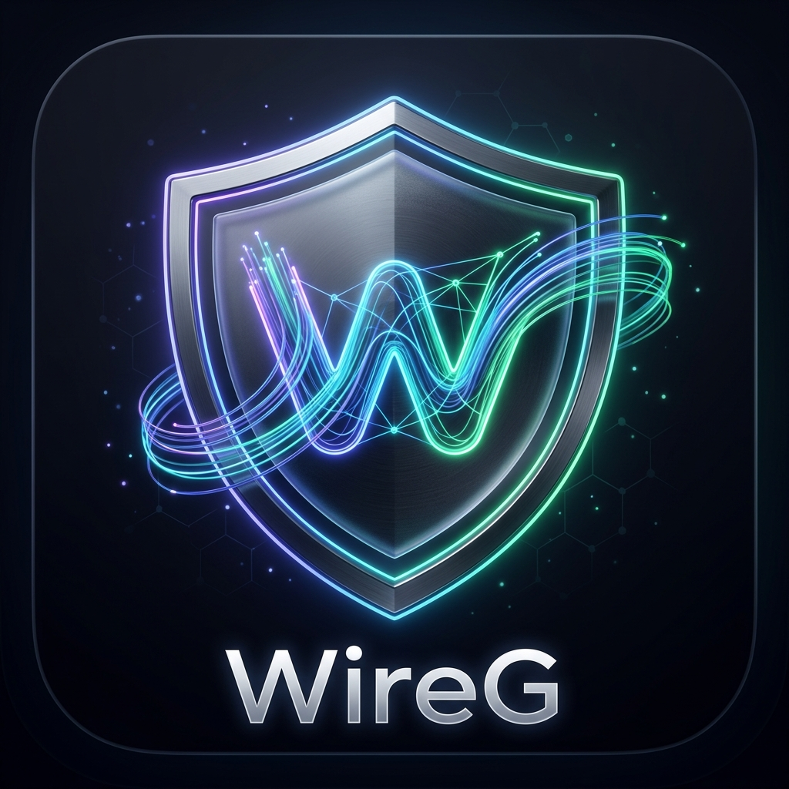
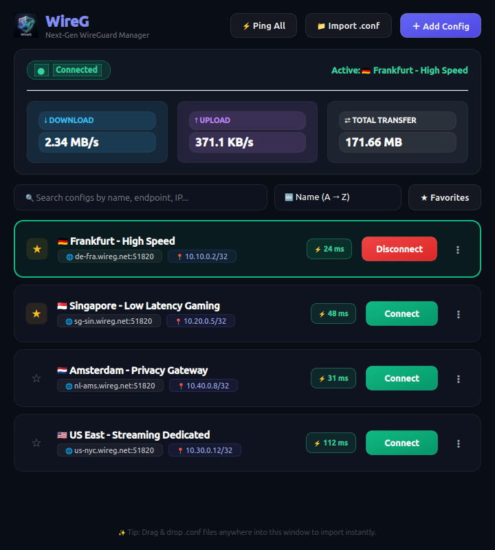

<p align="center">
  
</p>

<h1 align="center">WireG — Modern WireGuard Client for Linux</h1>

<p align="center">
  <a href="https://www.python.org/downloads/"></a>
  <a href="https://pypi.org/project/PyQt6/"></a>
  <a href="https://www.wireguard.com/"></a>
  <a href="https://kernel.org/"></a>
  <a href="LICENSE"></a>
</p>

<p align="center">
  <b>WireG</b> is a modern, lightweight, and feature-rich desktop client for managing and connecting to <b>WireGuard</b> VPN tunnels on Linux. Designed with a <b>shadcn-inspired Glassmorphism UI</b>, WireG provides an intuitive experience with instant connections, live traffic metrics, dual-mode configuration editing, and seamless mobile QR sharing.
</p>

<p align="center">
  
</p>

---

## ✨ Features

- 🎨 **shadcn Glassmorphism Design**: Frosted glass panels, glowing neon accents (Indigo, Emerald, Ruby, Cyan), crisp borders, and a locked fixed-size layout.
- 📥 **Easy Config Import & Drag-and-Drop**: Import standard `.conf` files via file picker or simply drag & drop files directly into the application window.
- 📝 **Dual-Mode Config Editor**:
  - **Visual Form**: Clean fields for `[Interface]` and `[Peer]` with built-in WireGuard keypair generation.
  - **Raw Text (.conf)**: Direct INI editing with syntax checks and bidirectional sync.
- ⚡ **Smart Multi-Stage Latency & Ping Testing**:
  - Pre-connection ICMP/TCP ping to endpoints with color-coded latency pills (Green/Yellow/Red).
  - **Ping All** button to benchmark all tunnels in parallel using background worker threads.
- 📊 **Realtime Network Traffic Monitor**:
  - Live download (`↓`) and upload (`↑`) speeds with session data transfer counters.
  - Directly queries Linux kernel stats without requiring root privileges.
- 📱 **Mobile QR Code Generator**: Generate standard WireGuard QR codes instantly to scan and import configurations on iOS / Android WireGuard apps.
- 🔐 **Passwordless Connections**:
  - Includes a dedicated security helper (`wireg-helper`) and Polkit / Sudoers rules.
  - Connect and disconnect instantaneously with zero recurring password prompts.
- 🔍 **Search & Multi-Criteria Sorting**:
  - Live search across config names, server endpoints, and internal IPs.
  - Sort by: Name (A-Z / Z-A), Lowest Latency, Highest Latency, Recently Used, or Date Added.
  - Star / Pin favorite configurations to the top.
- 🔔 **System Tray Integration**: Minimize to tray with quick connection toggling, live status indicator dot, and desktop notifications.

---

## 🚀 Quick Start

### 1. Prerequisites
Ensure `wireguard-tools` and `python3-pyqt6` are installed on your Linux distribution:

#### Ubuntu / Debian / Linux Mint:
```bash
sudo apt update
sudo apt install wireguard-tools python3-pyqt6 policykit-1
```

#### Arch Linux / Manjaro:
```bash
sudo pacman -S wireguard-tools python-pyqt6 polkit
```

#### Fedora / RHEL:
```bash
sudo dnf install wireguard-tools python3-pyqt6 polkit
```

---

### 2. Enable Passwordless Connection Mode (One-Time Setup)
To allow WireG to manage tunnels without repeatedly prompting for superuser / root passwords:

```bash
sudo ./setup_permissions.sh
```

---

### 3. Launch WireG

```bash
./run.sh
# or
python3 main.py
```

### 4. Install Desktop Shortcut (Optional)
To add WireG to your Linux desktop application launcher / app menu:

```bash
./install.sh
```

---

## 🧪 Running Automated Tests

Run the complete test suite to verify configuration parsing, storage persistence, QR generation, and headless GUI lifecycle:

```bash
python3 -m unittest discover -s tests -v
```

---

## 📂 Project Architecture

```
WireG/
├── main.py                         # Application entry point
├── run.sh                          # Quick execution script
├── install.sh                      # Desktop shortcut installer
├── setup_permissions.sh            # One-time passwordless permission setup
├── assets/
│   ├── logo.png                    # Master high-res application logo
│   ├── icon.png                    # Application icon
│   ├── icons/                      # Multi-resolution icons (16px to 512px)
│   └── screenshots/                # Showcase screenshots
├── wireg/
│   ├── app.py                      # Application lifecycle coordinator
│   ├── core/
│   │   ├── config_manager.py       # Config parsing, INI serialization & JSON store
│   │   ├── wireguard_service.py    # Non-blocking wg-quick & helper manager
│   │   ├── wireg-helper.sh         # Privileged interface management script
│   │   ├── ping_tester.py          # Parallel latency benchmark worker pool
│   │   ├── traffic_monitor.py      # Non-root /sys/class/net/ traffic observer
│   │   └── qr_generator.py         # Pure Python offline QR Code generator
│   ├── ui/
│   │   ├── main_window.py          # Main dashboard & drag-and-drop controller
│   │   ├── config_card.py          # Glassmorphic config card widget
│   │   ├── config_editor_dialog.py # Dual-mode form/raw configuration editor
│   │   ├── qr_dialog.py            # Mobile QR Code modal
│   │   ├── traffic_widget.py       # Live bandwidth dashboard
│   │   ├── tray_icon.py            # System tray icon with quick actions
│   │   └── styles.py               # shadcn Glassmorphism QSS design system
│   └── utils/
│       ├── paths.py                # XDG config directory management (~/.config/wireg)
│       └── validator.py            # Key, IP CIDR, and endpoint validation
├── samples/
│   └── example.conf                # Sample WireGuard configuration
└── tests/                          # Automated unit and integration tests
```

---

## 📄 Example Configuration Format

```ini
[Interface]
PrivateKey = aAAAAAAAAAAAAAAAAAAAAAAAAAAAAAAAAAAAAAAAAAA=
Address = 10.0.0.2/32
DNS = 1.1.1.1, 8.8.8.8

[Peer]
PublicKey = bBBBBBBBBBBBBBBBBBBBBBBBBBBBBBBBBBBBBBBBBBB=
AllowedIPs = 0.0.0.0/0, ::/0
Endpoint = vpn.example.com:51820
PersistentKeepalive = 25
```

---

## 🤝 Contributing

Contributions, issues, and feature requests are welcome! Feel free to check the [issues page](https://github.com/tohid-ab/WireG/issues).

---

## 📜 License

This project is licensed under the MIT License.
